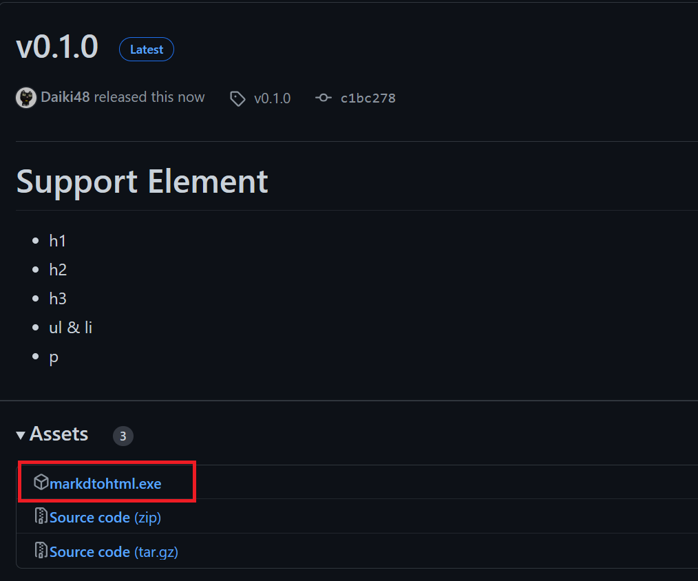
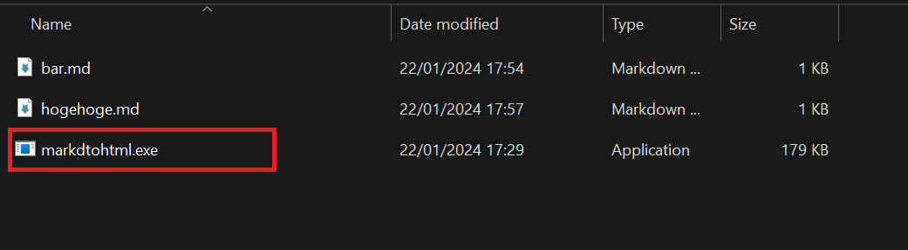
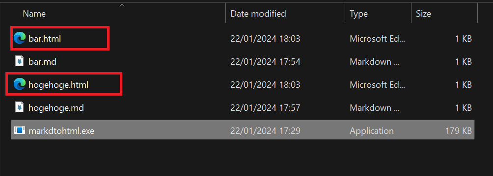
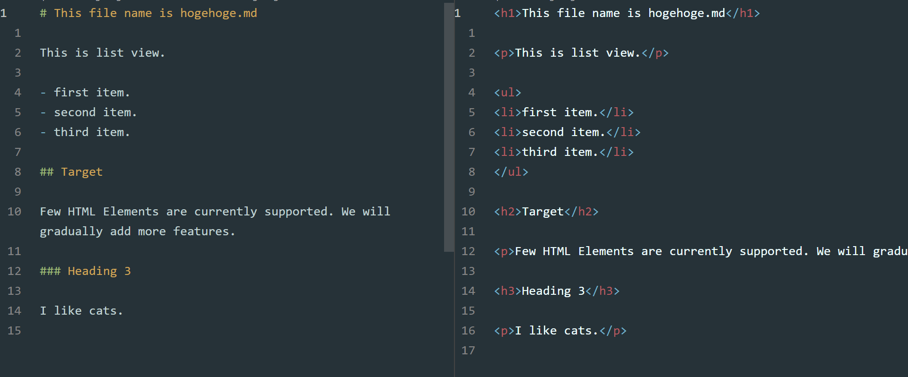

# markdtohtml

Tool to convert markdown files to html files. Supported elements are limited as it is still under development.

# Usage

## 1. Download exe file from GitHub

[GitHub](https://github.com/Daiki48/markdtohtml/releases)

## 2. Place the exe file

## 3. Run markdtohtml.exe

## 4. Check the content of the file

# Supported HTML elements

- h1
- h2
- h3
- ul & li
- p

# LICENSE

MIT

# Author

Daiki Nakashima